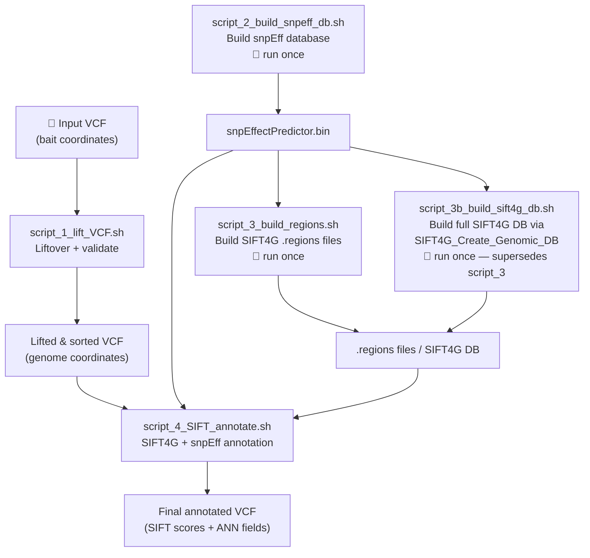

# SIFT4G + snpEff Annotation Pipeline — Script Overview

This pipeline annotates variants in a VCF file with functional consequence and deleteriousness scores, converting bait-coordinate variants into genome-coordinate variants ready for SIFT4G and snpEff analysis.

---

**script_1_lift_VCF.sh** — Liftover and validation
-Converts variant coordinates in the input VCF from bait space to genome space using a mapping TSV file.
-VCF sorted, indexed with bcftools
-VCF validated by checking that all chromosome names are present in the reference FASTA.

**script_2_build_snpeff_db.sh** — Build snpEff database *(run once)*
-Registers the *Bmas* genome in the snpEff config
-Copies the reference FASTA and GFF into the expected snpEff data directory
-Compiles the binary snpEff database (`snpEffectPredictor.bin`). This database is a prerequisite for both snpEff annotation and SIFT4G.

**script_3_build_regions.sh** — Build SIFT4G per-scaffold score files *(run once)*
-Extracts protein sequences from the genome using gffread
-Decompresses the UniRef90 database if needed, and runs the `sift4g` scorer to produce per-scaffold `.regions` files. These files encode substitution tolerance scores that the SIFT4G annotator looks up per variant.

**script_3b_build_sift4g_db.sh** — Build full SIFT4G genomic database via `SIFT4G_Create_Genomic_DB` *(run once; supersedes script_3)*
An alternative to script_3 that uses the `make-SIFT-db-all.pl` pipeline to produce a complete, annotator-ready SIFT4G database. It converts the GFF to GTF, sets up the required directory structure, writes a config file, and runs the full pipeline — handling protein extraction, sift4g scoring, and generation of the coordinate-indexed `.regions` and `.gz` files that `SIFT4G_Annotator.jar` requires.

**script_4_SIFT_annotate.sh** — Annotate variants *(run per dataset)*
Runs the two annotation steps on the lifted, sorted VCF. First, `SIFT4G_Annotator.jar` adds `SIFT_SCORE` and `SIFT_PRED` fields by looking up the `.regions` files. Then, `snpEff ann` adds `ANN` fields describing functional consequences (e.g. missense, synonymous, splice region) and predicted impact. The final VCF contains both annotations.

